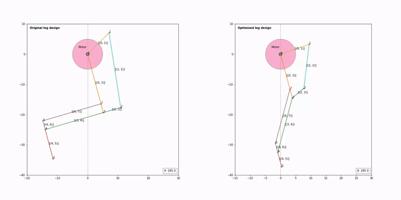
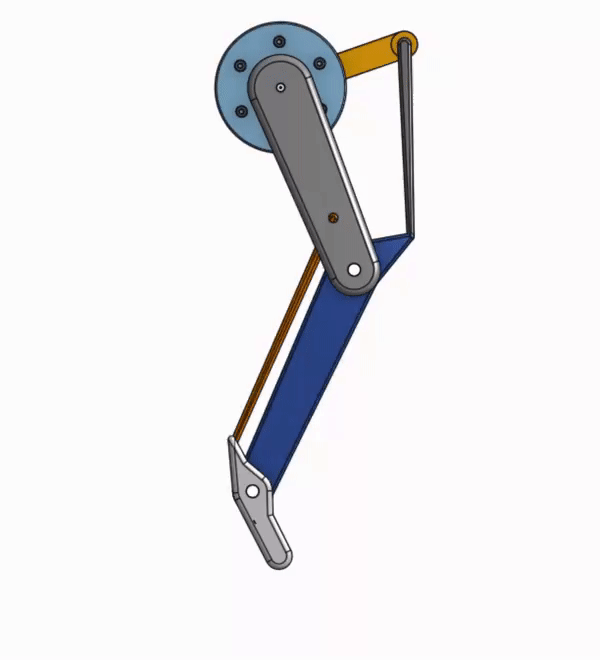

Simple Python notebook to optimize a leg linkage design such that the CoM stays above the foot during jumps.
It uses a least-square minimization (soft L1 loss) of foot position distance to the vertical, to decouple hip from knee motion. 
Eight parameters are optimized (link lengths and angles) with lower/upper bounds on each.

LEFT: Initual guess | RIGHT: Optimized leg linkage

An Onshape design of the leg with the optimized parameters.

